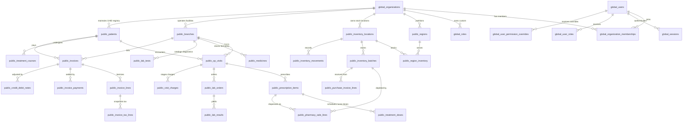

# Relational Architecture & Entity-Relationship Map

```mermaid
erDiagram
    global_organizations ||--o{ global_organization_memberships : "has members"
    global_organizations ||--o{ global_roles : "owns custom"
    global_organizations ||--o{ public_regions : "partitions"
    global_organizations ||--o{ public_inventory_locations : "owns stock locations"
    global_organizations ||--o{ public_branches : "operates facilities"
    global_organizations ||--o{ public_patients : "maintains UHID registry"

    global_users ||--o{ global_organization_memberships : "joins"
    global_users ||--o{ global_sessions : "authenticates"
    global_users ||--o{ global_user_roles : "receives"
    global_users ||--o{ global_user_permission_overrides : "receives overrides"

    public_regions ||--o{ public_region_inventory : "serves"
    public_inventory_locations ||--o{ public_region_inventory : "stocks"
    public_inventory_locations ||--o{ public_inventory_batches : "stores"
    public_inventory_locations ||--o{ public_inventory_movements : "records"

    public_branches ||--o{ public_op_visits : "hosts"
    public_branches ||--o{ public_medicines : "stocks formulary"
    public_branches ||--o{ public_lab_tests : "catalogs diagnostics"
    public_branches ||--o{ public_invoices : "bills"

    public_patients ||--o{ public_op_visits : "encounters"
    public_patients ||--o{ public_treatment_courses : "undergoes"
    public_patients ||--o{ public_invoices : "pays"

    public_op_visits ||--o{ public_prescription_items : "prescribes"
    public_op_visits ||--o{ public_lab_orders : "orders"
    public_op_visits ||--o{ public_visit_charges : "stages charges"

    public_prescription_items ||--o{ public_treatment_doses : "schedules nurse doses"
    public_prescription_items ||--o{ public_pharmacy_sale_lines : "dispensed via"

    public_inventory_batches ||--o{ public_pharmacy_sale_lines : "depleted by"
    public_inventory_batches ||--o{ public_purchase_invoice_lines : "received from"

    public_lab_orders ||--o{ public_lab_results : "yields"

    public_invoices ||--o{ public_invoice_lines : "itemizes"
    public_invoice_lines ||--o{ public_invoice_tax_lines : "snapshots tax"
    public_invoices ||--o{ public_invoice_payments : "settled by"
    public_invoices ||--o{ public_credit_debit_notes : "adjusted by"
```
